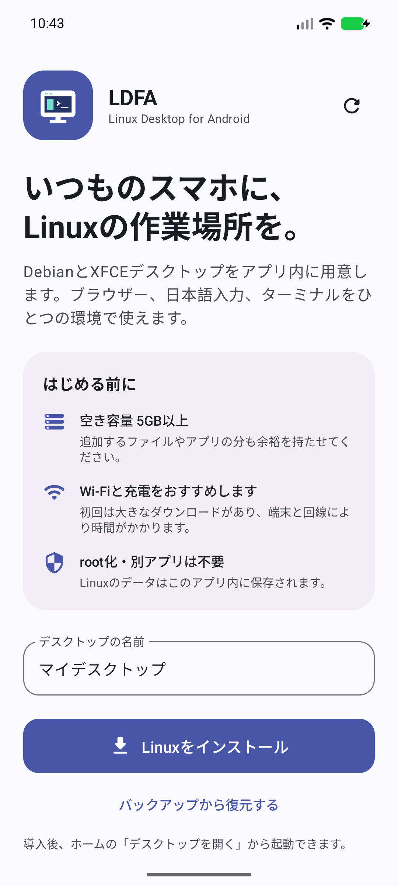

<p align="center"></p>

# LDFA — Linux Desktop for Android

[](https://github.com/hatake716/LDFA/actions/workflows/android.yml)
[](https://github.com/hatake716/LDFA/releases)

Androidに、DebianとXFCEの作業環境を。
LDFAは、Linuxの導入・起動・日本語入力・バックアップをひとつのAndroidアプリにまとめています。
root化や、別のTermux・X11アプリのインストールは不要です。

**検証版：1.2.0 / versionCode 21**

Android 15 / x86_64 / 4KBでLinuxの導入・表示・日本語入力・バックアップ復元を確認しています。Pixel 10a（Android 17 / ARM64 / 4KB）へのインストールと初回画面の表示も確認済みです。ARM64実機でのLinuxの導入・実行は未確認のため、GitHubではプレリリースとして提供します。

[リリースとAPK](https://github.com/hatake716/LDFA/releases) · [導入手順](docs/INSTALLATION.md) · [プライバシーポリシー](https://hatake716.github.io/LDFA/privacy.html)

## はじめる

1. [GitHub Releases](https://github.com/hatake716/LDFA/releases)の現行APKをインストールします。AABはGoogle Playへの提出用で、直接インストールするファイルではありません。
2. アプリを開き、空き容量5GB以上と通信環境を確認します。
3. デスクトップの名前を入力し、**「Linuxをインストール」**を押します。
4. Debian、XFCE、日本語入力などの構築が終わったら、ホームの**「デスクトップを開く」**を押します。

初回は大きなダウンロードがあるため、Wi-Fiと充電をおすすめします。所要時間は端末と回線によって変わります。
画面を移動しても導入は継続します。Androidによるプロセス終了や通信障害があった場合はアプリを開き直し、必要に応じてカードの修復操作から再開してください。

既存の`.ldfa`バックアップがある場合は、初回画面の**「バックアップから復元する」**から、新しい環境として取り込めます。

## 画面

<p>  </p>

画面は署名済み1.2.0を検証用エミュレーターで動かして撮影しています。

## できること

- 複数のDebian 12 / XFCE環境を作成・切り替え
- 内蔵X11によるLinuxデスクトップ表示
- Google ChromeとNode.js 22 LTSの導入
- 日本語ロケール、Noto CJK、Fcitx5 / Mozc
- タッチ・マウス・ソフトウェアキーボード・物理キーボードによる操作
- デスクトップ全体の表示倍率100〜250%、特殊キーバーの表示切り替え、JIS / US配列
- PulseAudio経由のAndroid音声出力
- 停止したLinux環境を`.ldfa`ファイルへバックアップし、新しい環境へ復元
- ターミナル、ログ、導入・起動の修復

## 1.2.0の変更

- 初回の説明からLinuxの導入までを、一続きの操作に整理しました。
- 実行環境の準備と導入処理をアプリ側で保持し、画面の再作成で取り消されないようにしました。
- 展開済みのDebianを再利用し、中断したパッケージ構築を再開します。失敗時に環境を自動削除しません。
- 導入中は実際の構築段階を表示し、詳細ログは必要なときに開けます。
- 起動済みの環境からデスクトップへ戻る操作と、停止操作を分けました。
- 起動失敗・環境切り替え時のネイティブプロセスの終了処理を補強しました。
- Androidのプロセス終了APIだけでは残るPRootを、所有者と起動時刻を確認して停止し、そのPRootが管理するLinuxプロセスも終了します。
- ChromeやNode.jsの準備も単層PRootへまとめ、二重実行によりAPTのファイル操作が失敗する経路を修正しました。
- デスクトップの一時保存先をLinux側の`/tmp`へ設定し、Chromeがプロファイルのソケットを作成できない問題を修正しました。
- バックアップと起動・削除の競合、Android 8〜9でバックアップが一時領域の削除に巻き込まれる問題を修正しました。
- バックアップ復元時に、PRootが作成する内部リンクを復元先へ付け替え、日本語ロケールなどが元の環境を参照する問題を修正しました。
- 新しいアダプティブアイコンと配色、Android 16を対象とした設定に更新しました。

検証条件・結果は[検証資料](docs/TESTING.md)に記録します。過去の実機確認を、新しいバージョンの確認結果として扱いません。

## 動作環境とデータ

| 項目 | 内容 |
| --- | --- |
| Android | 8.0（API 26）以降。targetSdk 36 |
| Google Play提出用AAB | ARM64（arm64-v8a） |
| 空き容量 | 新規導入時5GB以上。追加ファイルやバックアップには別途容量が必要 |
| 通信 | Linux初回導入・パッケージ更新時に必要 |
| アプリID | `com.hatake716.linuxdesktop` |
| Linuxの保存先 | Androidが管理するLDFA専用のアプリ領域 |

アプリのアンインストールや「ストレージを消去」は、保存したLinux環境も削除します。
必要なデータは、事前に「ツール → バックアップ」でアプリ外へ保存してください。
Android 10以降の保存先は**ダウンロード / LinuxDesktop**です。Android 8〜9はアプリ専用の外部ファイル領域に保存されるため、表示された保存先から端末外へコピーしてください。

公式TermuxとはアプリIDと保存領域が異なるため共存できます。
旧GitHub配布版v1.1.0以前は`com.termux`でした。旧版からの移行は、旧版でバックアップを作成して新版で復元します。別の署名のAPKに上書きできない場合も、データを保存する前にアンインストールしないでください。
Google Play版のアプリ署名とGitHub APKの署名は、Play App Signingの設定によって異なる場合があります。

## Linuxとしての制約

LDFAはAndroidカーネル上でPRootを使います。PC向けLinuxの仮想マシンではなく、systemd、デバイスアクセス、カーネル機能を必要とするソフトウェアには制約があります。

ChromeはPRootとの互換性のため`--no-sandbox`などのオプションを使用します。Linux PCのChromeと同じブラウザー内の隔離は提供しません。
Linuxの`desktop`ユーザーにはパスワードなしの`sudo`を設定しますが、Androidのroot権限を得るものではありません。

Androidの省電力・メモリ管理による終了を完全には防げません。LDFAは前景サービス、実行中の通知、プロセス監視、再接続処理を使って継続と復旧を支えます。

ネイティブライブラリの16KB配置を検査していますが、ARM64の16KB端末でLinuxを導入して動作させる検証は未実施です。開発用x86_64 APKでは、Android 17の16KBプレビュー環境でDebianゲストの起動時にSIGBUSを確認しています。実行確認に使用したAndroid 15の4KB環境とは区別してください。

## 開発・ビルド

```bash
git clone --recurse-submodules https://github.com/hatake716/LDFA.git LDFA-google-play
cd LDFA-google-play
./gradlew :app:testDebugUnitTest :app:assembleDebug
```

JDK 17、Android SDK 36、NDK 29.0.14206865を使用します。
`local.properties`にSDKの場所を設定してください。署名設定はGit管理外の`keystore.properties`に置き、秘密鍵本体はリポジトリ外で保管します。

```bash
bash scripts/check-host-script.sh
bash scripts/test-host-controller.sh
bash scripts/check-x11-controller.sh
./gradlew testDebugUnitTest :app:lintDebug :termux-runtime:lintDebug :embedded-x11:lintDebug
./gradlew :app:assembleRelease :app:bundleRelease
```

署名付きのAPK・AAB、Google Playの提出文面・素材については[リリース手順](tools/release/README.md)と[Play Console資料](tools/release/play-console.md)を参照してください。
署名設定がない環境のrelease出力は未署名です。

| ディレクトリ | 役割 |
| --- | --- |
| `app/` | Compose画面、導入・セッション管理、バックアップ、Linux用スクリプト |
| `termux-runtime/` | 内蔵ターミナル、APK内の実行環境の展開 |
| `embedded-x11/` | X11表示・サービス・ライフサイクル補強 |
| `vendor/` | Termux、Termux:X11と依存ソース |
| `scripts/` | Linux / X11コントローラーの検証 |
| `tools/bootstrap/` | 専用アプリID向けbootstrapの再ビルド手順 |
| `release-assets/` | ローカルの署名済み成果物・提出素材・検証記録（Git管理外） |

内部構成は[アーキテクチャ](docs/ARCHITECTURE.md)を参照してください。

## ライセンスと関連プロジェクト

LDFAはGPL-3.0で公開しています。詳細は[LICENSE](LICENSE)を参照してください。
同梱する各コンポーネントのライセンス・著作権表示も保持しています。

- [Termux](https://github.com/termux/termux-app)
- [Termux:X11](https://github.com/termux/termux-x11)
- [PRoot-Distro](https://github.com/termux/proot-distro)
- [Debian](https://www.debian.org/)
- [XFCE](https://www.xfce.org/)
