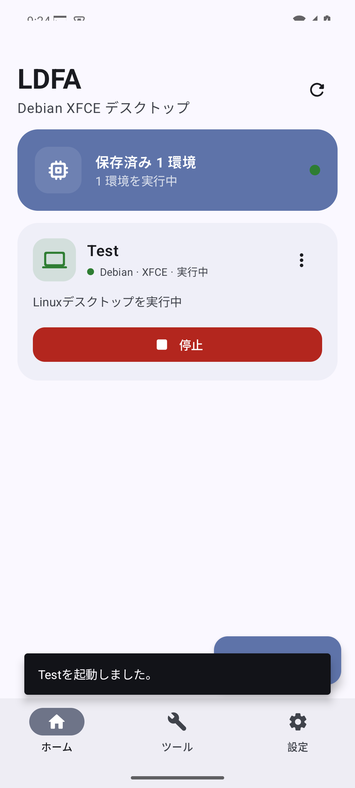
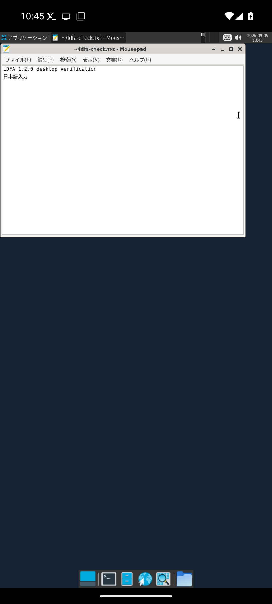
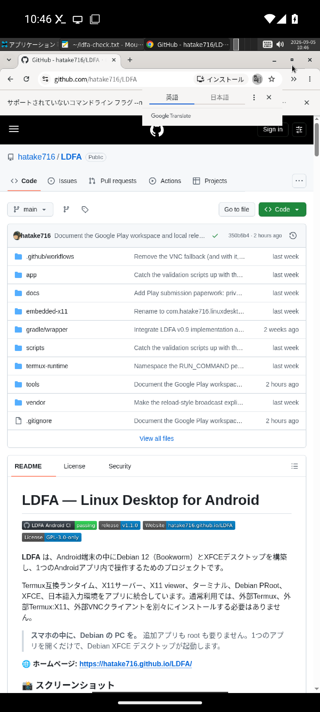
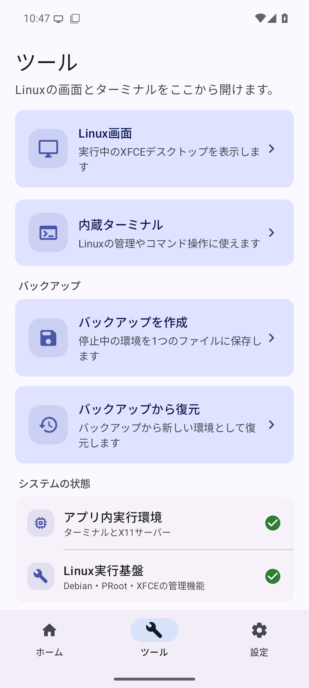
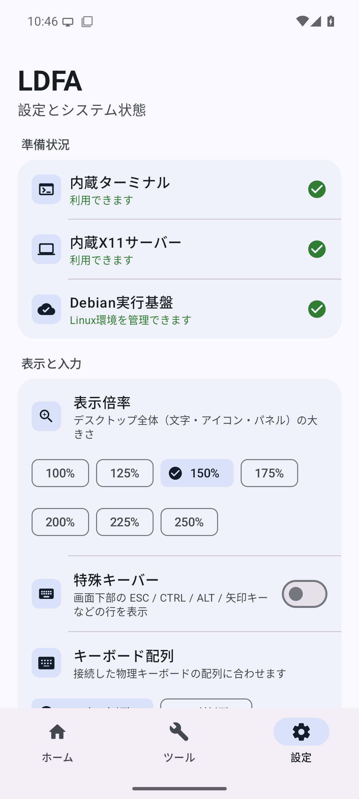
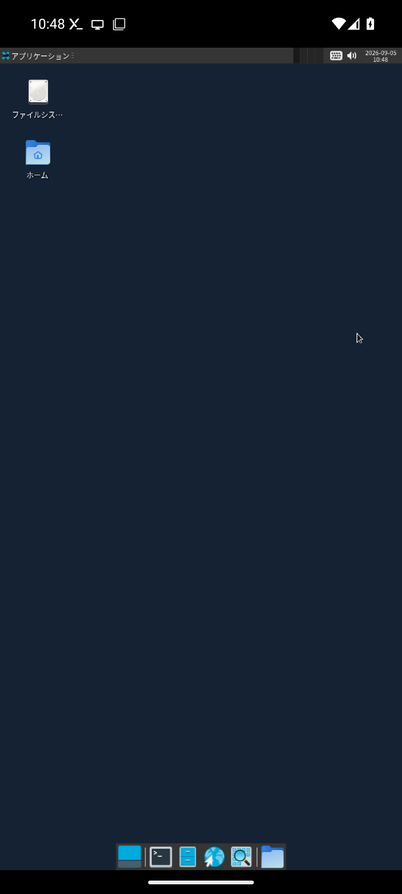
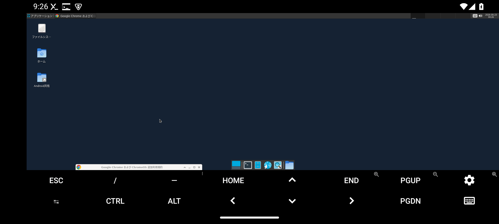
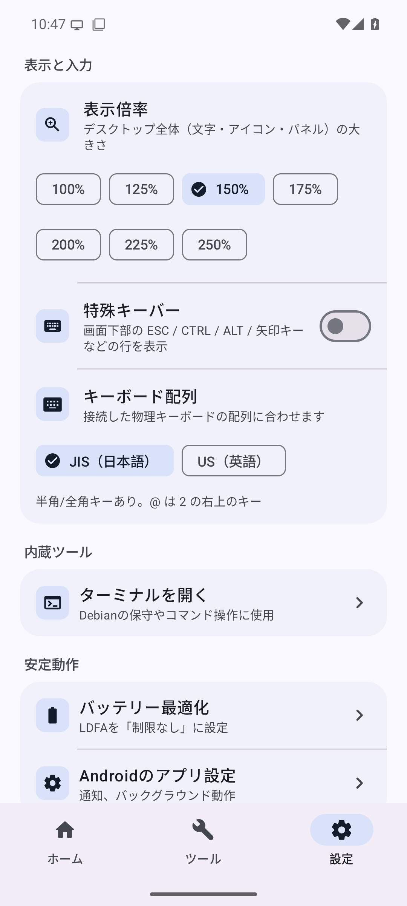

# LDFA — Linux Desktop for Android

[](https://github.com/hatake716/LDFA/actions/workflows/android.yml)
[](https://github.com/hatake716/LDFA/releases/tag/v1.0.1)
[](https://hatake716.github.io/LDFA/)
[](LICENSE)

**LDFA** は、Android端末の中にDebian 12（Bookworm）とXFCEデスクトップを構築し、1つのAndroidアプリ内で操作するためのプロジェクトです。

Termux互換ランタイム、X11サーバー、X11 viewer、ターミナル、Debian PRoot、XFCE、日本語入力環境をアプリに統合しています。通常利用では、外部Termux、外部Termux:X11、外部VNCクライアントを別々にインストールする必要はありません。

> **スマホの中に、Debian の PC を。** 追加アプリも root も要りません。1つのアプリを開くだけで、Debian XFCE デスクトップが起動します。

🌐 **ホームページ: <https://hatake716.github.io/LDFA/>**

### 📸 スクリーンショット

Androidの管理画面から環境をワンタップで起動し、そのまま本物のLinuxデスクトップが立ち上がります。

<table>
  <tr>
    <td width="33%" align="center">
      <br>
      <sub><b>ホーム</b> — 環境をワンタップ起動</sub>
    </td>
    <td width="33%" align="center">
      <br>
      <sub><b>デスクトップ</b> — Thunar と Chrome が動作</sub>
    </td>
    <td width="33%" align="center">
      <br>
      <sub><b>Google Chrome</b> — 公式版を自動導入</sub>
    </td>
  </tr>
  <tr>
    <td width="33%" align="center">
      <br>
      <sub><b>ツール</b> — 内蔵環境の状態を可視化</sub>
    </td>
    <td width="33%" align="center">
      <br>
      <sub><b>設定</b> — 準備状況を一目で確認</sub>
    </td>
    <td width="33%" align="center">
      <br>
      <sub><b>XFCE</b> — 日本語デスクトップと音声出力</sub>
    </td>
  </tr>
</table>

<p align="center">
  <br>
  <sub>横向き表示 — 同じセッションのまま画面の向きに追従</sub>
</p>

### ⬇️ 入手（v1.0.1 正式版）

**[▶ Releases から `LDFA-v1.0.1-debug.apk` をダウンロード](https://github.com/hatake716/LDFA/releases/tag/v1.0.1)**

1. 上のリンクから APK をダウンロードします（提供元不明アプリの許可が必要な場合があります）。
2. アプリを開き、案内に沿って内蔵ランタイム・ストレージ権限・Debian 環境の初回セットアップを完了します（初回は数分）。
3. 環境を追加し「Debian XFCE を開く」でデスクトップを起動します。

> 詳しい手順は [APKの入手方法](#apkの入手方法) と [初回セットアップ](#初回セットアップ) を参照してください。配布 APK はデバッグ署名です。上書き更新できるよう、署名鍵は固定してリポジトリに含めています。

## 現在のステータス

| 項目 | 状態 |
| --- | --- |
| バージョン | `1.0.1` / versionCode `18` |
| リリース段階 | **正式版公開済み**。[Releases v1.0.1](https://github.com/hatake716/LDFA/releases/tag/v1.0.1) からAPKを入手できます |
| Linux環境 | Debian 12（Bookworm）+ XFCE |
| 通常表示 | 内蔵native X11、`DISPLAY=:1` |
| 最終フォールバック | TigerVNC + noVNC、`DISPLAY=:2` |
| ローカル／AVD検証 | clean build、158 unit tests（app 13）、3 module lint、4 ABI APK、host／X11スクリプトの静的gateを確認。API 35 x86_64・4 KB page AVDではChrome + Gboard、履歴からの通常復帰、Chrome／XFCE強制終了後の自動復旧を確認 |
| 実機検証 | Pixel 10a（ARM64・8 GB RAM）でnative起動・表示倍率の拡大・上書き更新インストールまで確認済み。ARM64 16 KB pageは未完了 |
| 音声受け入れ | **実機で可聴出力を確認済み**（動画音声がAndroidスピーカーから再生）。SHM無効化＋socket隔離による修正版を反映 |
| 表示・入力 | デスクトップ全体の**表示倍率 100〜250%（25%刻み）**、画面下部の**特殊キーバー（ESC/CTRL/ALT/矢印など）のON/OFF**を設定から切り替え可能。実機で拡大表示を確認済み |
| 起動時間 | プロビジョニング確認を4→1 PRoot loginへ削減、さらに成功時の冗長なPRoot login1回と固定待ちを削減。2回目以降の起動を高速化 |
| 上書き更新 | デバッグ署名鍵をリポジトリに固定し、どの環境でビルドしても同じ鍵で署名。既存インストールへ上書き更新できることを実機で確認済み |

物理ARM64での長時間運用とARM64 16 KB page端末のE2Eは継続検証中のため、日常データを置く唯一のLinux環境としてではなく、バックアップを取ったテスト環境として使用してください。

## 主な機能

- Android上に複数のDebian 12環境を作成、保存、切り替え
- XFCEデスクトップを内蔵X11 viewerへ直接表示
- デスクトップ全体の表示倍率を100〜250%（25%刻み）から選択（文字・アイコン・パネル・ウィンドウを一律拡大）
- 画面下部の特殊キーバー（ESC／CTRL／ALT／矢印など）を設定からON/OFF
- Debian／XFCE／Chromeの音声を内蔵PulseAudio bridgeからAndroidスピーカーへ出力
- タッチ、マウス、物理キーボード、ソフトウェアキーボードで操作
- 日本語ロケール、Noto CJK、日本語キーボード、Fcitx5 + Mozcを自動設定
- Google公式のGoogle Chrome stableを64-bit Debianへ自動導入
- Node.js 22 LTS（公式静的ビルド）を自動導入し、`npm install -g`でClaude CodeやCodexなどのCLIを利用可能に
- 一般ユーザー`desktop`とパスワードなし`sudo`を構成
- Android共有ストレージをDebianの`/mnt/android`へ接続
- 内蔵ターミナルからDebianを保守
- 作成、起動、停止、修復、削除とログ表示をMaterial 3 UIへ統合
- native X11が利用できない場合にlegacy描画、互換VNCへ段階的にフォールバック
- Foreground Service、WakeLock、heartbeat、世代IDで実行中セッションを監視
- Surface再作成時の全画面再描画、main process回収後の安全な再接続、停止／再起動を考慮したX11 lifecycle
- Chrome／XFCE子プロセスがAndroidに個別終了された場合のイベント駆動型自動復旧

### 音声出力

音声はX11やVNCへ混在させず、Debian clientからTermux互換runtimeのPulseAudioへ
app-private Unix socketで送ります。Debianでは
`PULSE_SERVER=unix:/tmp/ldfa-pulse/native`、Android側では
`$PREFIX/var/run/ldfa-pulse-bridge/native`として同じsocketを共有します。socketは
`$PREFIX/tmp`の外へ置き、各guest loginへ明示`--bind`でguestの`/tmp/ldfa-pulse`へmapする
ため、`--shared-tmp`のPRoot tmp churnがsocketを消す競合を回避します。PRootはSHM／memfd
descriptorをguest境界越しに渡せないため、client／daemon双方でshared memoryを無効化し、
再生streamがsocket transportで確実にsinkへ届くようにします。匿名TCP portは公開しません。

既存のDebian環境も、更新後の停止→起動時にPulse／ALSA client設定とXFCE panelの
音量・mute項目を安全に移行します。ユーザーが作成した`~/.config/pulse/client.conf`や
`~/.asoundrc`は上書きしません。今回の対象は再生出力であり、マイク入力権限は追加して
いません。

## 動作要件

- Android 8.0（API 26）以降
- 64-bit ARM端末を推奨
- Debian環境1つにつき、最低3〜5 GB程度の空き容量を推奨
- 初回セットアップ時の安定したインターネット接続
- Android共有ストレージへのアクセス許可
- 互換VNC表示を使用する場合はAndroid System WebView

APKには`arm64-v8a`、`armeabi-v7a`、`x86`、`x86_64`のnativeライブラリを収録しています。ただし、Google Chrome公式Linuxパッケージの自動導入対象は`arm64`と`amd64`だけです。32-bit環境ではChromeを別ブラウザへ無断で置換せず、Debian／XFCEの構築だけを継続します。

## インストール前に必ず確認してください

### 公式Termuxとは同時インストールできません

内蔵Termuxランタイムは、互換性のため次の固定パスを使用します。

```text
/data/data/com.termux/files/usr
```

そのためLDFAのapplication IDは`com.termux`です。署名が異なる公式Termuxや別ビルドの`com.termux`とは同時インストールできません。

既存Termuxに必要なスクリプト、SSH鍵、パッケージ、ホームディレクトリがある場合は、LDFAをインストールする前に必ずバックアップしてください。署名の異なるアプリへ`adb install -r`で上書きすることはできません。

### PRootは完全なLinux仮想マシンではありません

DebianはAndroidカーネル上のPRootとして動作します。systemd、カーネル機能、デバイスアクセス、sandbox、低レベルsyscallの挙動は、通常のDebian PCや仮想マシンと異なります。

### Google Chromeのsandbox制約

Android PRoot内ではChrome本来のnamespace／setuid sandboxを確立できません。LDFAの専用ランチャーは、一般ユーザー`desktop`から次の互換オプションでChromeを起動します。

```text
--no-sandbox
--disable-dev-shm-usage
--disable-background-mode
--disable-breakpad
--disable-crash-reporter
--disable-extensions
--disable-component-extensions-with-background-pages
--disable-gpu
--no-zygote
--ozone-platform=x11
--password-store=basic
--renderer-process-limit=2
```

Webコンテンツ用rendererの上限は、Googleログインとの互換性を残して2にしています。Chrome自身のUI用rendererが別に1つ動作する場合があるため、`--type=renderer`の総数は通常3になります。拡張機能とbackground pageは停止しています。LDFAのChromeでは拡張機能を利用できません。`--single-process`や強制low-end-device modeは安定性・互換性を損ねるため使用しません。通常のLinux版ChromeよりWebコンテンツの隔離が弱くなります。信頼できないサイトやダウンロードファイルを扱う場合は、この制約を前提にしてください。詳細は[SECURITY.md](SECURITY.md)を参照してください。

## APKの入手方法

### 1. GitHub Releases から入手（推奨）

**[Releases v1.0.1](https://github.com/hatake716/LDFA/releases/tag/v1.0.1)** から `LDFA-v1.0.1-debug.apk` をダウンロードします。音声出力・表示倍率・起動高速化を含む、CIで検証済みのビルドです。配布 APK はデバッグ署名ですが、署名鍵をリポジトリに固定しているため、旧バージョンからの上書き更新が可能です。

### 2. GitHub Actions の artifact から入手

最新の `main` の[CI run](https://github.com/hatake716/LDFA/actions/workflows/android.yml)から APK artifactを取得できます。Actions artifactには保存期限があります。

### 3. ローカルにAPKがある場合のインストール例

```bash
adb install -r LDFA-v1.0.1-debug.apk
```

端末やADBの設定によってtest APKとしての許可を求められる場合は、`-t`を追加します。

```bash
adb install -r -t LDFA-v1.0.1-debug.apk
```

## 初回セットアップ

LDFAの初回画面では、1つの主ボタンが次に必要な操作を順番に案内します。

1. 内蔵ターミナルランタイムを展開
2. 内蔵X11サーバーを確認
3. Android共有ストレージへのアクセスを許可
4. Debian環境の表示名を入力
5. Debian 12、XFCE、日本語環境、Google Chromeを自動構築

Debian、デスクトップパッケージ、ロケール、フォント、Mozc、Chromeを取得するため、初回構築には時間がかかります。処理中はアプリ内で進捗とログを確認できます。AndroidがLDFAをバックグラウンド制限しないよう、可能であればバッテリー設定を「制限なし」にしてください。

構築が完了すると、ホーム画面の環境カードに「Debian XFCEを開く」が表示されます。

## デスクトップを起動する

環境カードの「Debian XFCEを開く」を押します。

X11 service、Unix socket、Binder、Android Surface、EGL renderer、XFCEを順に準備するため、ボタンを押してからデスクトップが表示されるまで少し時間がかかります。起動中は次の注意を管理画面に表示します。

> デスクトップが表示されるまで少し時間がかかります。初回や更新直後は数分かかる場合があります。そのままお待ちください。

既存のDebian環境にGoogle Chromeがまだない場合は、アプリ更新後の最初の起動前にChromeを追加します。このときもネットワーク速度により数分かかる場合があります。

起動時はおおむね次の順でhealth checkを行います。

1. Android所有のX11 Foreground Service
2. X11 Unix socketとDebianからの`xset q`
3. viewer ActivityとBinder FD接続
4. Android SurfaceとEGL renderer
5. 成功したEGL presentationの増分
6. `xfsettingsd`、`xfwm4`、Panel、Desktopと実際のEWMHウィンドウ
7. XFCE起動後の再描画

画面だけを閉じた場合、同じ環境を再度開くと実行中セッションへ再接続します。環境カードの「停止」を押すと、viewer、X11 server、XFCE、PRootの順で停止します。

## Google Chrome

ChromeのDEBをAPKへ固定収録するのではなく、Debian構築時にguest architectureを確認してGoogle公式のcurrent stable packageを取得します。

- `amd64`: `google-chrome-stable_current_amd64.deb`
- `arm64`: `google-chrome-stable_current_arm64.deb`

インストール前にDEBのPackage fieldが`google-chrome-stable`であり、Architecture fieldがguestと一致することを検証します。Chromeが作成する署名済みAPT sourceは保持されるため、Debian側のAPTから更新できます。

既存環境ではデスクトップ起動前に、Chrome本体、LDFA専用launcherの世代、XFCE desktop entryを確認します。Chrome本体が導入済みでもlauncherが古ければ、DEBを再取得せずに省メモリ版launcherへ更新します。

専用launcherはWebコンテンツ用renderer processを最大2個に抑え、拡張機能とbackground modeを無効化し、glibc arena数を抑制します。Chrome UI用rendererはこの上限とは別です。1プロセス化やJavaScript heapの極端な固定上限は、Googleログインや一般サイトを壊す可能性があるため設定していません。

Androidソフトウェアキーボード側では、内蔵X11 viewerの`InputConnection`が初期化途中のActivityを固定保持しないようにしています。Gboardのcomposition callbackごとに現在のActivityを取得するため、Googleログイン欄で入力を始めた瞬間のnull参照を回避します。

キーボード表示中は、隠れた下端を描画時だけ切り取らず、X11の画面解像度を実際の可視領域へ一時的に合わせます。これにより一部のAndroid GPUで発生する「マウスポインタだけが残り、デスクトップが黒くなる」状態を避け、同時にキーボード表示中のframebuffer使用量も抑えます。既存インストールにも更新後の最初のviewer起動時に自動適用され、キーボードを閉じると元の解像度へ戻ります。

Gmailなど別アプリから戻ったときにAndroidがviewerのSurfaceを作り直す場合は、既存のX11 root pixmap全体を明示的にdamageし、新しいSurfaceへ直ちに再描画します。X11上で次のウィンドウ更新が起きるまで黒いframeが残り、別レイヤーのマウスポインタだけが見える状態を防ぎます。

メモリ圧迫でAndroidがmain processだけを回収し、専用`:x11` processやChromeが残った場合も、保存された世代だけを信用せず、service PID、Unix socket、X11 lock ownerがすべて一致することを確認してから実行中viewerへ再接続します。

Androidはシステム全体をlow-memoryと判定していない場合でも、同一アプリUID配下のChromeやXFCEの子プロセスだけを個別終了することがあります。LDFAはPRootで不安定なICE lockを必要とする`xfce4-session`を常駐させず、`xfsettingsd`、`xfwm4`、Panel、Desktopを直接監視します。監視は定周期の`ps`や`xset`を生成しないBashのイベント待機で、いずれかが終了した時だけ4要素を再確認・再起動します。Chromeが異常終了していれば最後のセッションも自動復元します。

viewer表示中の定期heartbeatは、既に確認済みのX11 serviceを軽量に監視するだけです。履歴や別アプリから戻った瞬間は、まずAndroidの`/proc`だけを読み、現在のDebianコンテナに属するsupervisor、その直接の子であるXFCE 4要素、Chromeの異常終了markerとbrowser本体を照合します。正常ならRunCommand、PRoot、診断shellを1個も追加せず、そのまま再表示します。欠落がある場合だけ、セッション内supervisorの復旧を最大3秒待つか、controllerによる厳密なウィンドウ検査・段階的復旧へ進みます。実際にAndroid processが終了した場合は、アプリ内ログの`Android process / memory`で`ApplicationExitInfo`の終了理由と同一UIDのRSS／swapを確認できます。

Chrome本体と依存パッケージによる追加使用量はバージョンによって変わります。x86_64の動的検証では、Chrome packageの`Installed-Size`は約431 MiBでした。

Chromeの初回起動時には、Google Chromeの利用規約確認が表示されます。

## Node.jsとコマンドラインツール（Claude Code / Codex など）

Debian 12のaptが提供するNode.jsは18系で、Claude Code（Node 22以上が必要）など最近のCLIには古すぎます。そのためLDFAは、環境作成時にNode.jsの**公式静的ビルド（22 LTS）**をSHA-256検証のうえ`/opt/nodejs`へ導入し、`node`／`npm`／`npx`を`/usr/local/bin`へリンクします。npmのグローバルprefixは`/usr/local`に設定してあり、`npm install -g`したCLI（`claude`など）は`/usr/local/bin`へ入ります。ここはログイン・非ログインを問わずすべてのシェルのPATHに含まれるため、インストール直後からターミナルでそのまま実行できます（PRoot環境ではrootfs全体を同じAndroid uidが所有するため`sudo`も不要です）。

内蔵ターミナルまたはXFCEのターミナルから、通常どおりインストールできます。

```bash
node --version      # v22.x
npm install -g @anthropic-ai/claude-code
claude --version

npm install -g @openai/codex
codex --version
```

これらのCLIは実行時にプラットフォーム別のネイティブバイナリを取得します。LDFAのDebianはglibcベースのため、`linux-x64`／`linux-arm64`（glibc）ビルドが選ばれ、PRoot上で動作します。導入にはネットワーク接続が必要です。32-bit環境ではNode.jsの自動導入をスキップし、デスクトップは通常どおり起動します。

公式サイトのcurlインストーラも利用できます。こちらはnpmを使わず、ランチャーを`~/.local/bin`へ配置します。

```bash
curl -fsSL https://claude.ai/install.sh | bash
claude --version
```

LDFAは`~/.local/bin`と`~/.npm-global/bin`を`.profile`（ログインシェル）と`.bashrc`（XFCEターミナルの非ログインシェル）の両方でPATHへ追加するため、npm版・curl版のどちらで入れてもターミナルからそのまま実行できます。ゲスト側の`curl`と`ca-certificates`もNode.jsと同時に導入します。**fish**をログインシェルにしている場合、fishは`.profile`も`.bashrc`も読みませんが、LDFAは`/etc/fish/conf.d/00-ldfa.fish`を用意し、fishでも同じPATH（`~/.local/bin`など）と設定が反映されるようにしています。fishを後から導入した場合も、この設定は自動で有効になります。

`command not found: claude`となる場合は、まず`node --version`を確認してください。表示されない場合はNode.js自動導入がまだ実行されていません（旧版APKのままか、導入時にネットワークへ到達できなかった）。**更新版APKを上書きインストールした後、環境を一度停止→起動**すると自動導入が走ります（導入済みならNode本体は再ダウンロードせず設定のみ更新）。それでも見つからない場合は`npm install -g @anthropic-ai/claude-code`を再実行してください。旧版で`~/.npm-global`へ入れたCLIも、`.profile`／`.bashrc`／fish設定のPATHによりそのまま使えます。**シェルの設定は新しいシェルから有効になる**ため、ターミナルを開き直すか、環境を一度停止→起動してください。

## デスクトップアプリ（Claude Desktop など Electron 製アプリ）

Claude Desktop for Linuxをはじめ、VS Code・Slackなど**Electron／Chromium製のGUIアプリ**は、インストールできても**そのままでは起動しません**。これらはChromiumのサンドボックスを初期化するときに、SUIDの`chrome-sandbox`ヘルパー（root遷移が必要）か、非特権のuser namespaceを要求します。Android PRoot環境ではゲストの実uidはAndroidアプリのuidのままで、そのどちらも成立しないため、アプリは画面が出る前にサンドボックス初期化で異常終了します（`zygote … write: Broken pipe`など）。

LDFAはこれを2段構えで自動的に解消します。まずデスクトップセッションと`desktop`ユーザーのシェル設定に`ELECTRON_DISABLE_SANDBOX=1`を設定します。多くのElectronアプリ（Claude Desktopなど）はこの変数を検出して`--no-sandbox`を付与するため、追加設定なしで起動できます。ただし一部の硬化されたアプリ（**OpenAIのChatGPTアプリ**など）は内部でサンドボックスを再強制するため、この環境変数を無視します。そこでLDFAは**デスクトップ起動のたびに、インストール済みのElectronアプリを自動検出**し、各アプリの`.desktop`ランチャーへ`--no-sandbox`を付けたユーザー用の上書きエントリを作成します。これにより、手動で後からインストールしたElectronアプリも、次回のデスクトップ起動で自動的に起動できるようになります（LDFA同梱のChromeは対象外。既に専用ランチャーで動作します）。Chromeを`--no-sandbox`で動かしているのと同じ扱いで、PRootとこれらのアプリを強いセキュリティ境界として扱わないでください。

Claude Desktop for Linux（`amd64`／`arm64`）は公式のaptリポジトリから導入できます。

```bash
sudo curl -fsSLo /usr/share/keyrings/claude-desktop-archive-keyring.asc https://downloads.claude.ai/claude-desktop/key.asc
echo "deb [arch=amd64,arm64 signed-by=/usr/share/keyrings/claude-desktop-archive-keyring.asc] https://downloads.claude.ai/claude-desktop/apt/stable stable main" | sudo tee /etc/apt/sources.list.d/claude-desktop.list
sudo apt update && sudo apt install claude-desktop
```

OpenAIのChatGPTデスクトップアプリ（`amd64`／`arm64`）は公式の`.deb`から導入できます。

```bash
# arm64端末の場合（Intel/AMDなら chatgpt_amd64.deb）
cd ~/Downloads
wget https://persistent.oaistatic.com/codex-app-prod/linux/deb/latest/chatgpt_arm64.deb
sudo apt install ./chatgpt_arm64.deb
```

導入後にアプリが起動しない場合は、更新版APKを上書きインストールしてから**環境を一度停止→起動**してください。デスクトップ起動時に上書きエントリが作成され、アプリメニューから起動できるようになります。

## 表示倍率と特殊キーバー

アプリの**設定 → 表示**から、デスクトップの見え方を2つ調整できます。

<p align="center">
  <br>
  <sub><b>設定 → 表示</b> — 表示倍率（100〜250%）と特殊キーバーの切り替え</sub>
</p>

### 表示倍率（100〜250%）

高DPIの端末ではXFCEデスクトップが小さく表示されることがあります。**表示倍率**から、デスクトップ全体（文字・アイコン・パネル・ウィンドウ）の大きさを**100%〜250%（25%刻み）**から選べます。内蔵X11サーバー（Termux:X11）自身の表示スケール機能で、論理解像度を縮小してAndroid画面いっぱいに引き伸ばすため、フォント・アイコン・パネル・Chromeなどが一律に拡大されます。

倍率は`Xft/DPI`（フォントとウィンドウ枠）、パネル高さ、デスクトップアイコンサイズ、カーソルサイズ、およびGTK/Qtアプリ向けの環境変数（`QT_SCALE_FACTOR`など）へまとめて反映されます。**デスクトップ起動中は即時**に反映され（パネルは自動で再読み込み）、**停止中に変更した場合は次回起動時**に適用されます。設定は環境ごとに保存され、再起動後も維持されます。

### 特殊キーバー（ESC／CTRL／ALT／矢印など）

タッチ操作でも `Ctrl+C` や矢印キー、`ESC`、`HOME`／`END` などを送れるよう、画面下部に特殊キーの行を表示できます。物理キーボードを使う場合や画面を広く使いたい場合は、**特殊キーバー**のスイッチでOFFにして非表示にできます。切り替えはデスクトップ起動中でも即時に反映されます。

Debian側では次の環境変数を設定し、XFCE session開始時にFcitx5を自動起動します。

```text
GTK_IM_MODULE=fcitx
QT_IM_MODULE=fcitx
XMODIFIERS=@im=fcitx
```

日本語入力エンジンはMozcです。API 35 x86_64 AVDでは、`nihongo`から候補「日本語」を選び、XFCE terminalへ確定できることまで確認しています。

## Androidとのファイル共有

環境ごとのAndroid共有ディレクトリを、Debian内の次のパスへ接続します。

```text
/mnt/android
```

XFCEのデスクトップには「Android共有」へのショートカットを作成します。共有ストレージはバックアップやAndroidアプリとの受け渡しに利用できますが、重要データは別の場所にも保存してください。

## 表示アーキテクチャ

通常表示はAndroid所有のX11 serviceと、Termux:X11由来のviewerをアプリへ埋め込んだ構成です。旧`app_process`、loader APK、custom `PathClassLoader`、TCP 7892による通常接続は使用しません。

```text
LDFA管理UI
   |
   v
LinuxDesktopRepository
   |
   +--> EmbeddedX11ServerService (process: com.termux:x11)
   |          |
   |          +--> libXlorie / Xorg :1
   |          |          |
   |          |          +---- Unix socket ---- Debian PRoot / XFCE
   |          |
   |          +---- ICmdEntryInterface Binder / X connection FD
   |                                      |
   +--------------------------------------+
                                          v
                                Termux:X11 MainActivity
                                          |
                                          v
                                      LorieView
                                          |
                                          v
                                    Android Surface
```

Xorg serverは管理UIとは別の`com.termux:x11`プロセスで動作します。service起動ごとにUUID世代とPID markerを照合し、古い世代が完全に終了してから次の世代を開始します。

表示Activityとnative EGL rendererは現在main processに含まれます。mutex、EGL初期化、JNI ABI、Binder/FD世代競合、Surface再作成、teardownに対するhardeningは実装済みですが、vendor EGL driver内部の永久hangやnative SIGSEGVを管理UIから完全隔離するには、viewerの別process化が今後も必要です。

詳細は[docs/ARCHITECTURE.md](docs/ARCHITECTURE.md)を参照してください。

## 描画フォールバック

```text
native X11 :1 / 通常描画
        |
        | classified failure
        v
native X11 :1 / legacy描画
        |
        | failure after clean teardown
        v
TigerVNC :2 / noVNC viewer
```

native X11は`DISPLAY=:1`、互換VNCは`DISPLAY=:2`、RFBは`127.0.0.1:5902`、noVNCは`127.0.0.1:6080`を使用します。X11 TCPは`-nolisten tcp`で無効化しています。

normal、legacy、VNCを同時起動せず、切り替え前に前のviewer、server、socket、lock、workerを停止します。

## 内蔵ターミナルとログ

設定画面の「ターミナルを開く」から内蔵ターミナルを起動できます。設定画面の死んでいた「X11ディスプレイを開く」は削除済みで、実行中デスクトップを表示する機能はツール画面側に残しています。

Debianへパッケージを追加する例:

```bash
sudo apt update
sudo apt install <package>
```

主なログ:

```text
Android process / memory
ApplicationExitInfoによる前回終了理由、同一UIDのRSS／swap集計

Debian / XFCE
~/.local/share/linux-desktop-for-android/logs/<環境ID>.log

Native X11
~/.local/share/linux-desktop-for-android/logs/x11-server.log

Compatibility VNC
~/.local/share/linux-desktop-for-android/logs/vnc-server.log
```

ADBから確認する例:

```bash
adb shell pidof com.termux
adb shell pidof com.termux:x11
adb logcat -s LorieNative gles-renderer MainActivity
```

## 現在の検証状況

v1.0.1（versionCode 18）に対する結果です。

| 検証項目 | 結果 |
| --- | --- |
| host controller static/integration gates | PASS |
| X11 controller static gates | PASS |
| clean Gradle build | PASS |
| unit tests | 全体 158 / 158 PASS（app 13 / 13） |
| app / termux-runtime / embedded-x11 lint | PASS、error 0 |
| `arm64-v8a` / `armeabi-v7a` / `x86` / `x86_64` build | PASS |
| APK v2 signature | PASS、固定debug certificate（`2c53b411…`） |
| APK zipalign 16 KB check | PASS |
| arm64-v8a / x86_64 `.so` PT_LOAD alignment | 全対象`0x4000`以上 |
| API 35 x86_64・4 KB AVDでDebian 12 clean install | PASS |
| native X11、XFCE、Surface再作成、background復帰 | 履歴画面から通常復帰後、約0.25秒でChrome／XFCE全体を再表示してPASS。従来の10回連続試験もPASS |
| Fcitx5 + Mozc日本語確定 | PASS |
| Android共有ストレージ往復 | PASS |
| Google Chromeの起動とHTTPSページ描画 | PASS |
| app-private PulseAudio Unix bridge | source／生成session／stateful controller／APK内assetの各gate PASS。旧TCP endpointと公開listenerは不在 |
| Androidからの可聴音声 | **実機で可聴出力を確認済み**（動画音声がAndroidスピーカーから再生） |
| 表示倍率（100〜250%） | 実機でデスクトップ全体の拡大表示を確認済み |
| 特殊キーバーのON/OFF | 起動中の即時切り替えを実装、AVDで動作確認 |
| 上書き更新インストール | 固定署名鍵により、旧バージョンへの上書き更新が成功することを実機で確認済み |
| 起動高速化 | 成功パスの冗長なPRoot login1回・close時の固定待ち・pkill／dbusの固定sleepを削減。worst-caseはソース上不変を維持 |
| native failureからVNC `:2`へのfallback | PASS |
| stop後のX11/XFCE/PRoot/socket cleanup | PASS |
| 物理ARM64端末のnative起動 | PASS |
| Googleログイン + Androidソフトウェアキーボード | API 35 x86_64・4 GB RAM AVDでGboard表示、`test`のcomposition／候補確定、コンテンツrenderer上限2（UI用を含む総renderer 3）を確認。Gmailへ移動して戻る操作は10 / 10回黒画面なし。Pixel 10aではパスワード入力までPASS |
| ARM64 16 KB page端末 | **未検証** |
| process個別終了からの復旧 | main processだけの再生成と既存`:x11`への再接続にPASS。さらに履歴表示中にChrome全プロセスとXFCE 4要素を同時終了する試験を3回実行し、必要要素は1.24〜2.03秒で再生成、約3〜4秒でChrome内容を自動復元し、永久黒画面なし。`ldfa-session` PIDは全回不変で二度目のsession再構築なし |

APKの16 KB alignment成功は、Debian userlandとXFCEを含むARM64 16 KB実機E2Eの成功を意味しません。この二つは別の受け入れ条件です。

## 実機での確認項目

物理ARM64端末では少なくとも次を確認しています（16 KB page端末は継続検証中）。

1. 既存の必要なTermuxデータをバックアップする。
2. LDFAをclean installし、Debian 12の構築を完了する。
3. 「Debian XFCEを開く」からnative X11でデスクトップを表示する。
4. タッチ、スクロール、ソフトウェアキーボード、可能なら物理マウス／キーボードを確認する。
5. Fcitx5 + Mozcで日本語を入力・確定する。
6. Google Chromeを起動し、HTTPSページを表示する。
7. 既存環境へ更新した場合は一度停止→起動し、修復前の`audio_ready` metadata、host log、socket、module、非`auto_null` sink、guest接続をread-onlyで保存する。その後に`audio-probe`も確認するが、probeは修復とmetadata更新を行うためstartup成功の代用にはしない。
8. Chromeの音声付き動画または既知のWAVを再生し、再生中にPulseAudioの`sink-input`が現れることを確認する。
9. XFCE panelの音量項目からmute／unmuteと音量変更を確認する。
10. Android本体speakerで実際に音を聞き、利用予定ならBluetooth／有線routeへの切替も確認する。
11. stop→startを3回繰り返し、専用`module-native-protocol-unix`が重複しないことを確認する。
12. Googleアカウントのログイン画面でAndroidソフトウェアキーボードを開き、入力・composition・確定を行う。本人確認のためGmailへ移動した後、履歴画面からLDFAへ戻り、プロセスが生存している通常復帰では1〜2秒以内にChrome／XFCE全体が再表示されることを複数回確認する。Androidが子プロセスを終了した場合も、マウスポインタだけの永久黒画面にならず自動復旧することを確認する。
13. `/mnt/android`でAndroidとのファイル往復を確認する。
14. 縦横回転、Homeからの復帰、画面消灯復帰を確認する。
15. 停止、再起動、画面の再表示を複数回行う。
16. 停止後にデスクトップやChromeのプロセスが残らないことを確認する。
17. 16 KB page端末の場合は、Debian loginとXFCE表示まで別途確認する。

問題が発生した場合は、端末機種、Androidバージョン、ABI、page size、操作手順、画面、LDFAログ、`adb logcat`を添えてください。

## ソースからビルド

### 必要なtoolchain

- JDK 17
- Gradle 8.13
- Android SDK platform 36
- Android build-tools 35.0.0 / 36.0.0
- Android NDK 29.0.14206865
- CMake 3.22.1
- Python 3
- Git submodules

### cloneと検証

音声出力・表示倍率・起動高速化を含む最新の状態は `main` に反映済みです。次の手順で
clone してビルド・検証できます。

```bash
git clone --recurse-submodules https://github.com/hatake716/LDFA.git
cd LDFA

bash ./scripts/check-host-script.sh
bash ./scripts/test-host-controller.sh
bash ./scripts/check-x11-controller.sh

bash ./gradlew --no-daemon --console=plain \
  clean \
  testDebugUnitTest \
  :app:lintDebug \
  :termux-runtime:lintDebug \
  :embedded-x11:lintDebug \
  assembleDebug
```

生成先:

```text
app/build/outputs/apk/debug/app-debug.apk
```

`gradlew`はGradle Wrapper JARがない場合、取得したJARをリポジトリ内のSHA-256 contractと照合します。CIはさらに、全ABIの`libXlorie.so`、必須JNI symbol、manifest、obsolete loader不在、16 KB zipalign、APK署名を検証します。

## ドキュメント

- [インストールと初回セットアップ](docs/INSTALLATION.md)
- [機能と構成の概要](docs/OVERVIEW.md)
- [X11／lifecycleアーキテクチャ](docs/ARCHITECTURE.md)
- [テスト手順](docs/TESTING.md)
- [セキュリティ上の注意](SECURITY.md)
- [第三者ソフトウェアとライセンス](THIRD_PARTY_NOTICES.md)
- [今回の起動修正と残課題の引き継ぎ](HANDOVER.md)

## ライセンス

LDFAは**GNU GPL version 3 only**（`GPL-3.0-only`）で提供され、明示・黙示を問わず無保証です。詳細は[LICENSE](LICENSE)と[THIRD_PARTY_NOTICES.md](THIRD_PARTY_NOTICES.md)を確認してください。

主な上流プロジェクト:

- Termux App
- Termux:X11
- Debian / proot-distro
- XFCE
- Fcitx5 / Mozc
- TigerVNC / noVNC
- Google Chrome（実行時にGoogle公式パッケージを取得）
